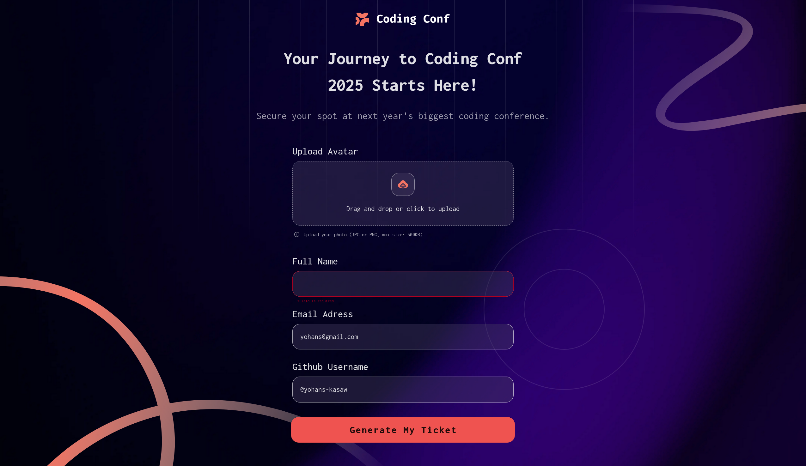
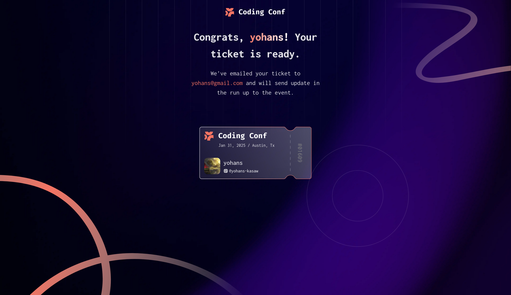

# Frontend Mentor - Conference ticket generator solution

## Table of contents

- [Overview](#overview)
  - [The challenge](#the-challenge)
  - [Screenshot](#screenshot)
  - [Links](#links)
- [My process](#my-process)
  - [Built with](#built-with)
  - [What I learned](#what-i-learned)
- [Author](#author)
- [Acknowledgments](#acknowledgments)

## Overview

### The challenge

Users should be able to:

- Complete the form with their details
- Receive form validation messages if:
  - Any field is missed
  - The email address is not formatted correctly
  - The avatar upload is too big or the wrong image format
- Complete the form only using their keyboard
- Have inputs, form field hints, and error messages announced on their screen reader
- See the generated conference ticket when they successfully submit the form
- View the optimal layout for the interface depending on their device's screen size
- See hover and focus states for all interactive elements on the page

### Screenshot

  

### Links

- Solution URL: [Add solution URL here](https://github.com/yohans-kasaw/frontend-master-conference-ticket-generator)
- Live Site URL: [Add live site URL here](https://frontend-master-conference-ticket-g.vercel.app/)

## My process

### Built with

- Vue 
- Vuetify
- tailwind

### What I learned
- tailwind styles
- file uploading
- hasing
- vue router and guarding
- image backgroundig
- svg handlening

## Author

- Website - [yohans kasaw](https://www.yohanskasaw.me/)

## Acknowledgments
- LLMS like gemini and grok
